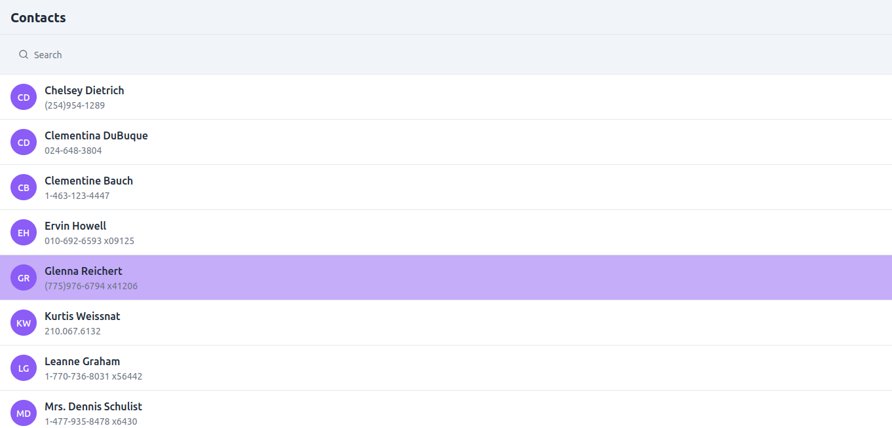

# 📇 Contacts App

A responsive **Contacts Application** built with **React**, **Vite**, and **Tailwind CSS**.  
This app fetches contact data from the [JSONPlaceholder API](https://jsonplaceholder.typicode.com/users) and allows users to:

- View a list of contacts
- Search for contacts by name
- Click on a contact to view more details in a modal

No Create, Update, or Delete (CRUD) functionality is implemented — this is a read-only browsing app.

---
### Home Page
Here is the main page showing the list of contacts:



---

## 📂 Folder Structure
contacts-app/
├── public/ # Public assets
│ └── vite.svg # Default Vite logo
│
├── src/ # Source code
│ ├── assets/ # Images, icons, etc.
│ │ └── react.svg
│ │
│ ├── components/ # React components
│ │ ├── ContactCard.jsx
│ │ ├── ContactList.jsx
│ │ ├── ContactModal.jsx
│ │ ├── LoadingSpinner.jsx
│ │ └── SearchBar.jsx
│ │
│ ├── App.css # Global styles for App
│ ├── App.jsx # Root component
│ ├── index.css # Tailwind CSS and global styles
│ └── main.jsx # Application entry point
│
├── .gitignore # Ignored files for Git
├── eslint.config.js # ESLint configuration
├── index.html # Main HTML template
├── package.json # Project dependencies and scripts
├── package-lock.json # Lock file for dependencies
├── postcss.config.js # PostCSS configuration
├── tailwind.config.js # Tailwind CSS configuration
├── vite.config.js # Vite configuration
└── README.md # Project documentation


## ⚡ Tech Stack
- **React** (UI library)
- **Vite** (Build tool)
- **Tailwind CSS** (Styling)
- **Fetch API** (For data fetching)
- **JSONPlaceholder API** (Dummy contact data)

---

## 🛠 Installation & Setup

Follow these steps to run the project locally:

### 1️⃣ Clone the repository
```bash
git clone git@github.com:donjoo/Resonate.git 
cd contacts-app

2️⃣ Install dependencies

    npm install

3️⃣ Run the development server

    npm run dev


    🎨 Features

Responsive and mobile-first design

Search bar for filtering contacts

Clean and modern UI using Tailwind CSS

Smooth modal for viewing contact details

Fast development experience with Vite


📡 API Reference

We are using JSONPlaceholder


Endpoint used:
    https://jsonplaceholder.typicode.com/users
    
    Example response:


            id	1
            name	"Leanne Graham"
            username	"Bret"
            email	"Sincere@april.biz"
            address	
            street	"Kulas Light"
            suite	"Apt. 556"
            city	"Gwenborough"
            zipcode	"92998-3874"
            geo	
            lat	"-37.3159"
            lng	"81.1496"
            phone	"1-770-736-8031 x56442"
            website	"hildegard.org"
            company	
            name	"Romaguera-Crona"
            catchPhrase	"Multi-layered client-server neural-net"
            bs	"harness real-time e-markets"